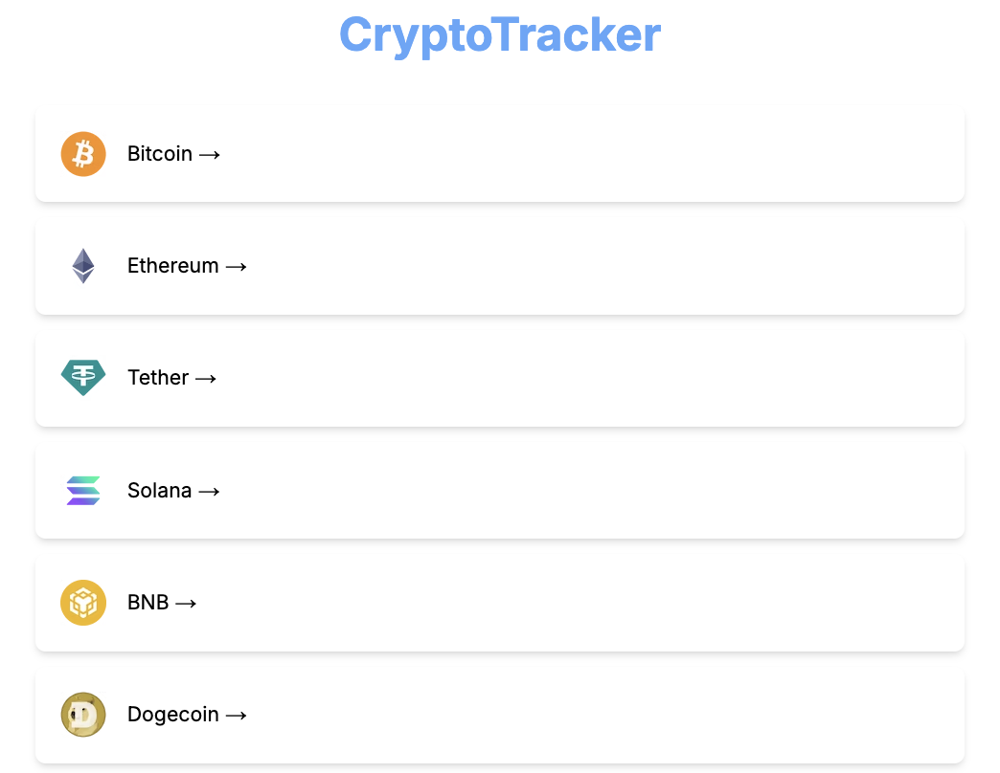
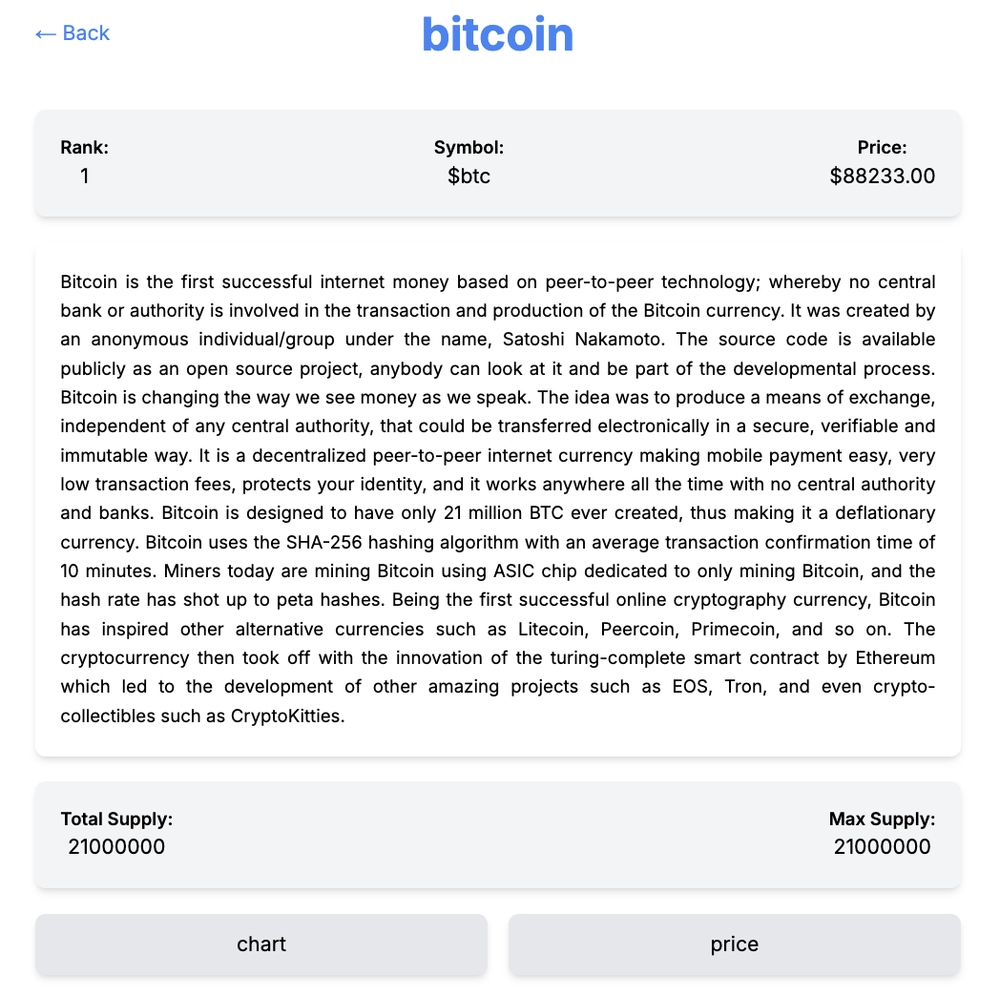
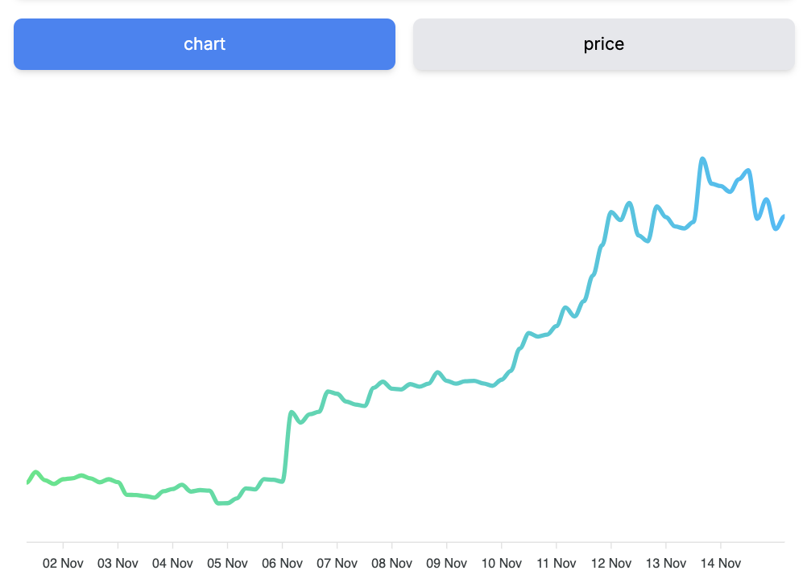
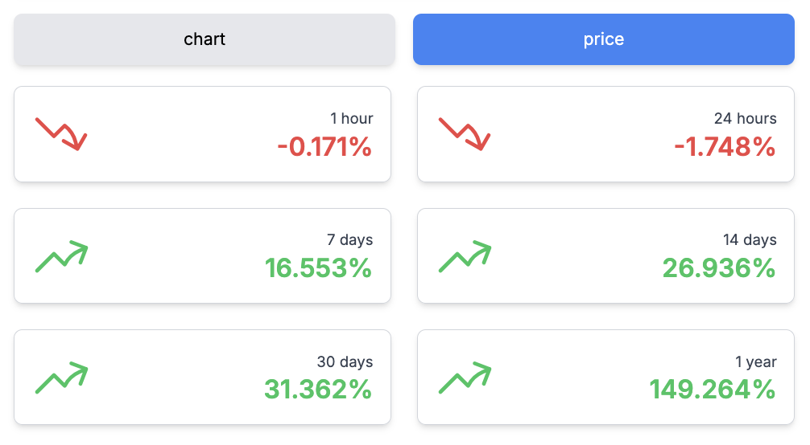

# CryptoTracker (Next.js Version)

## Overview
CryptoTracker is a Next.js-powered web application that provides real-time cryptocurrency data using the CoinGecko API. After migrating from React to Next.js, the application achieved significant performance improvements and a better user experience. With its enhanced efficiency and optimization, CryptoTracker is an essential tool for crypto enthusiasts and investors tracking market movements.

## Key Improvements
- **API Optimization:** Reduced redundant API calls, addressing public API call limit issues by caching data for 30 minutes and refetching only after that period.
- **Performance Enhancement:** Improved total page interaction time by 14%.
- **Accessibility Improvement:** Increased Chrome Lighthouse accessibility score from 76 to 95, a 25% enhancement.
- **Dark/Light Mode Toggle:** Allows users to switch between dark and light modes for a better visual experience.
- **UI Optimization:** Unified component shapes and optimized font performance for better readability and user experience.

## Main Page 

## Coin Page

## Price Trend Chart

## Price Info

## Technologies Used
- **Next.js & TypeScript:** For building a scalable, optimized frontend with server-side rendering features.
- **React Query:** Handles API calls and data caching, ensuring efficient synchronization with public APIs.
- **Tailwind CSS:** Provides clean and flexible styling, enhancing the visual appeal and responsiveness of the UI.
- **ApexCharts:** Integrated for interactive data visualization of cryptocurrency price trends.

## Future Improvements
While the migration to Next.js significantly improved performance and API efficiency, there is potential for further optimization. Future enhancements could include adopting Incremental Static Regeneration (ISR) for pages with less frequent updates, improving error handling for API failures, and expanding the application's reach with localization support. These updates aim to enhance scalability and user experience while maintaining efficient data usage.